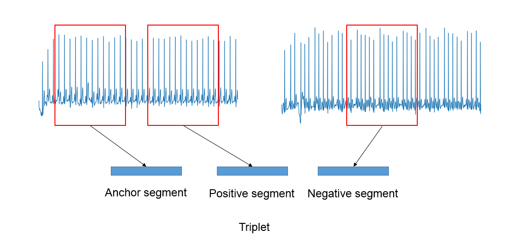

# Triplet model

Triplet model is designed to construct an ECG embedding. It learns to map an ECG signal into space of small dimension. We want any segment from the same ECG have close vectors in embedding space and segments from different ECGs have spaced vectors. 

The model is trained on triplets, where each triplet is a list [anchor_segment, positive_segment, negative_segment]. Anchor and positive segments are segments from the same ECG. Negative segment is a segment from other ECG. The next figure shows triplet.



Loss of the model is a difference *d*(anchor_segment, positive_segment) - *d*(anchor_segment, negative_segment), where *d* is some metric in embedding space. At the moment *d* is a cosine similarity metric.

## How to use
We applied this model to generate features of ECG signal that would increase accuracy of the following arrhythmia prediction. We generate triplets that include segments from both arrhythmia and non-arrhythmia signals. Train pipeline we used for the triplet model looks as follows:
```python
triplet_train_pipeline = (ds.Pipeline()
                          .load(fmt="wfdb", components=["signal", "meta"])
                          .load(src=".../REFERENCE.csv", fmt="csv", components="target")
                          .drop_labels(["~"])
                          .drop_short_signals(6000)
                          .replace_labels({"N": "NO", "O": "NO"})
                          .get_triplets(100, 3000, ['A', 'NO'])
                          .signal_transpose([0, 2, 1])
                          .train_on_batch('triplet_learn'))
```