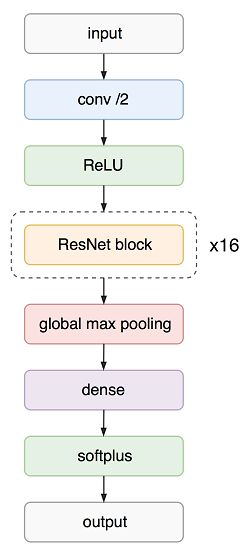
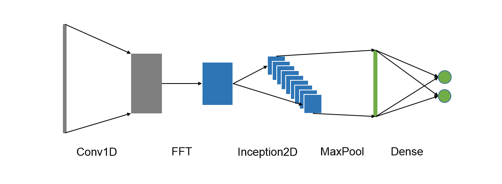

======
Models
======

This is a place where ECG models live. You can write your own model or exploit provided models. 

We have a number of built-in :doc:`models <../api/cardio.models>` for ECG classification and annotation:

DirichletModel
--------------

This model is used to predcit probability of atrial fibrillation. It predicts Dirichlet distribution parameters from which class probabilities are sampled. 

How to use
~~~~~~~~~~

.. code-block :: python

  dirichlet_train_ppl = (
    ds.Pipeline()
      .init_model("dynamic", DirichletModel, name="dirichlet", config=model_config)
      .init_variable("loss_history", init=list)
      .load(components=["signal", "meta"], fmt="wfdb")
      .load(src='./path/to/taret/', fmt="csv", components="target")
      .drop_labels(["~"])
      .replace_labels({"N": "NO", "O": "NO"})
      .flip_signals()
      .random_resample_signals("normal", loc=300, scale=10)
      .random_split_signals(2048, {"A": 9, "NO": 3})
      .binarize_labels()
      .train_model("dirichlet", make_data=make_data,
                   fetches="loss", save_to=V("loss_history"), mode="a")
      .run(batch_size=100, shuffle=True, drop_last=True, n_epochs=100, lazy=True)
  )

HMModel
-------

Hidden Markov Model is used to annotate ECG signal. This allows to calculate number of
important parameters, important for diagnosing.
This model allows to detect P and T waves; Q, R, S peaks; PQ and ST segments. The model 
has a total of 19 states, the mapping of them to the segments of ECG signal can  be found in ``cardio.batch.ecg_batch_tools`` submodule.

.. image:: hmmodel.png

How to use
~~~~~~~~~~

.. code-block :: python

  HMM_train_ppl = (
    ds.Pipeline()
      .init_model("dynamic", HMModel, "HMM", config=config_train)
      .load(fmt='wfdb', components=["signal", "annotation", "meta"], ann_ext='pu1')
      .wavelet_transform_signal(cwt_scales=[4,8,16], cwt_wavelet="mexh")
      .train_model("HMM", make_data=make_data)
      .run(batch_size=20, shuffle=False, drop_last=False, n_epochs=1, lazy=True)
  )

FFTModel
--------

FFT model learns to classify ECG signals using signal spectrum. At first step it convolves signal with a number of 1D kernels.
Then for each channel it applies fast fourier transform. 
The result is considered as 2D image and is processed with a number of Inception2 blocks
to resulting output, which is a predicted class. See below the model architecture:

How to use
~~~~~~~~~~
We applied this model to arrhythmia prediction from single-lead ECG. Train pipeline we used for the fft model looks as follows:

.. code-block :: python

  train_pipeline = (
    ds.Pipeline()
      .init_model("dynamic", FFTModel, name="fft_model", config=model_config)
      .init_variable("loss_history", init=list)
      .init_variable("true_targets", init=list)
      .load(fmt="wfdb", components=["signal", "meta"])
      .load(src='./path/to/taret/', fmt="csv", components="target")
      .drop_labels(["~"])
      .replace_labels({"N": "NO", "O": "NO"})
      .random_resample_signals("normal", loc=300, scale=10)
      .drop_short_signals(4000)
      .split_signals(3000, 3000)
      .binarize_labels()
      .apply(np.transpose , axes=[0, 2, 1])
      .ravel()
      .get_targets('true_targets')
      .train_model('fft_model', make_data=make_data, 
                   save_to=V("loss_history"), mode="a")
      .run(batch_size=100, shuffle=True,
           drop_last=True, n_epochs=100, prefetch=0, lazy=True)
  )

Below you can find a guide how to build your own model with Keras framework. More details you can find in our :ref:`tutorials <tutorials>`

How to build a model with Keras
-------------------------------

Any custom Keras model starts with base model :class:`KerasModel <dataset.KerasModel>`. In most cases you simply create
a new class that inherit KerasModel and define a sequence of layers within the _build method.
Once it is done you can include train and predict actions into pipeline.

For example, let's build a simple fully-connected network. It will accept signal with shape (1000, ) and return shape (2, ).
First, we import KerasModel:

.. code-block :: python

  from ...dataset.dataset.models.keras import KerasModel

Second, define our model architecture. Note that _build should return input and output layers.

.. code-block :: python

  class SimpleModel(KerasModel):
      def _build(self, **kwargs):
          '''
          Build model
          '''
          x = Input(1000)
          out = Dense(2)(x)
          return x, out

Third, we specify model configuration (loss and optimizer) and initialize model in pipeline.
We suppose that batch has a component named 'signal' (this will be our input tensor) and a component
named 'target' (this will be our output tensor).

.. code-block :: python

  model_config = {
      "loss": "binary_crossentropy",
      "optimizer": "adam"
      }

  template_simplemodel_train = (
  ds.Pipeline()
    .init_model("static", SimpleModel, name="simple_model", config=model_config)
    .init_variable("loss_history", init=list)
    ...
    some data preprocessing
    ...
    .train_model('simple_model', x=B('signal'), y=B('target'),
                 save_to=V("loss_history"), mode="a")
    .run(batch_size=100, shuffle=True,
           drop_last=True, n_epochs=100, prefetch=0, lazy=True)
  )

From now on ``train_pipeline`` contains compiled model and is ready for training.

Other capabilities
------------------

Aside of the classes described above, module ``models`` contains other submodules and files.

Training notebooks
~~~~~~~~~~~~~~~~~~

There are example notebooks for each model described above in ``models``. Those notebooks are used as tests and also provide examples of use.

keras_custom_objects
~~~~~~~~~~~~~~~~~~~~

This submodule contains custom layers used in keras models. 
To use those layers you can write
.. code-block:: python
  
  from cardio.batch import keras_custom_objects as kco

layers
~~~~~~

``layers`` submodule stores helper functions to create tensorflow layers and blocks.
The usage is similar to keras_custom_objects:

.. code-block:: python

  from cardio.batch import layers

metrics
~~~~~~~

In this module you can find hepler functions to calculate metrics of existing models.

.. code-block:: python
  
  from cardio.batch import metrics

API
---
See :doc:`Models API <../api/cardio.models>`